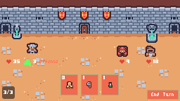
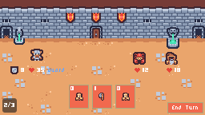
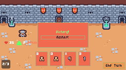

## Deck Builder Demo

A small turn-based deck builder prototype inspired by games like *Slay the Spire*.  
This project is a focused battle demo with momentum- and stance-based card synergies, multi-enemy encounters, and reusable Godot scene structure.

Recent feature notes are tracked in [CHANGELOG.md](CHANGELOG.md).

### Screenshots

| Opening battle | Flow / Offense | Guard block |
| --- | --- | --- |
|  |  |  |
| Current two-enemy opening board with the stance HUD, hand, and end-turn controls. | A Flow turn into Offense, showing how stance changes momentum and attack pressure. | Guard stance pushing block higher before the enemy phase. |

### Battle Result

The battle now ends with an explicit victory overlay and restart button, which gives the demo a clean finish state.

### Game Mechanics

The battle loop is built around a few simple systems:

* **Turn-based combat** - the player and enemies take alternating turns.
* **Deck, draw pile, discard pile** - cards are drawn from a shuffled deck, played from hand, and discarded at the end of the turn.
* **Mana economy** - each turn restores mana, and every card has a cost.
* **Block and health** - block absorbs damage first, while health ends the run when it reaches zero.
* **Card targeting** - cards can target the player, one enemy, all enemies, or everyone depending on their card type.
* **Momentum combo system** - several new cards build momentum, convert it into burst damage, and reward sequencing.
* **Stance system** - cards shift the player between Offense, Guard, and Flow, which changes damage, block, momentum, and draw bonuses.
* **Multi-enemy encounters** - the demo now includes more than one enemy so area attacks and split decisions matter.
* **Enemy intent** - enemies pick actions from a weighted action pool and can switch to conditional moves when their state changes.
* **Card state machine** - card UI uses a state machine for hovering, clicking, dragging, aiming, and releasing.

The current demo is still a compact battle slice, but the combat loop now has enough room for different deck lines, enemy patterns, and end-state polish.

### Tech Stack

* **Game Engine:** Godot 4
* **Language:** GDScript
* **UI / Scene System:** Godot scenes, nodes, signals, and autoloads
* **Art:** Aseprite and pixel-art assets
* **Audio:** Lightweight sound effects and background music bundled with the project

### Project Structure

The codebase is organized around reusable battle components:

* **`scenes/battle/`** - battle scene root and turn flow coordination
* **`scenes/player/`** - player node, player stats, and turn handling
* **`scenes/ui/`** - hand, mana display, stats UI, and tooltip UI
* **`custom_resources/`** - shared data resources for cards, piles, stats, and effects
* **`enemy/` and `enemies/`** - enemy node logic and enemy-specific AI/actions

### Current Scope

This is a prototype and not a full roguelike yet. The focus is on:

* validating combat rules
* testing node-based architecture
* iterating on card and enemy behavior
* keeping the demo small enough to debug quickly
* expanding the encounter and card pool in a way that still fits the existing combat shell
